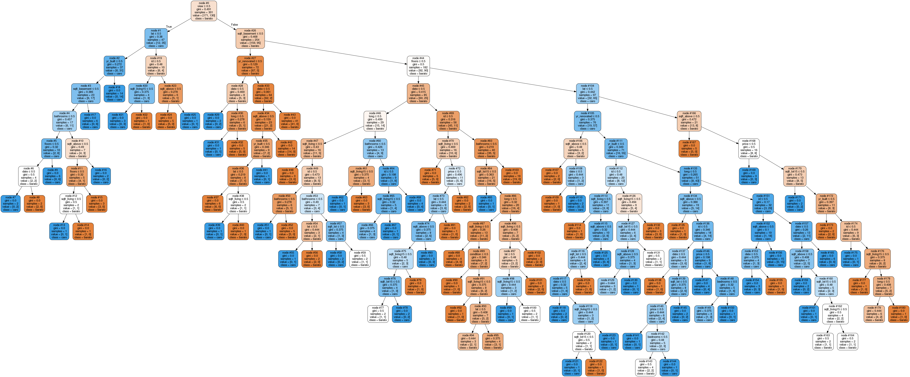

# chatbot_pe

Este projeto consiste na elaboração de um chatboot para a classificação do preço de residências em caras ou baratas em um determinado bairro, com o uso de Decision Tree 
Classification em Python, através da utiização de critérios que aumentam a precisão das árvores do chatboot. A seguir vejamos o passo a passo de desenvolvimento:

## Dados de uso

Utilizamos os dados referentes ao ZipCode : 98004 da tabela [House Sales in King County, USA](https://www.kaggle.com/harlfoxem/housesalesprediction), a qual contém 21 colunas.

## Desenvolvimento

- [X] **Tratamento dos dados de entrada:**
neste passo fizemos o tratamento dos dados com a ajuda da biblioteca [pandas](https://pandas.pydata.org/docs/user_guide/index.html) e da [csv](https://docs.python.org/pt-br/3/library/csv.html) no arquivo *data_treatment.py*, basicamente consiste na leitura dos dados totais presentes no arquivo *nossas_casas.csv* e o tratamento através de alguns critérios que selecionamos, os quais estão presentes no arquivo *criterios.csv*, com isso após esse tratamento há a geração dos arquivos tratados em forma binária, entitulados como *nossas_casas_tratadas_j.csv*.

- [X] **Geração da árvore:**
o proximo passo consiste na geração das árvores e na obtenção das precisões das árvores, nesta parte fizemos o uso das bibliotecas [pandas](https://pandas.pydata.org/docs/user_guide/index.html), [csv](https://docs.python.org/pt-br/3/library/csv.html), [sklearn.tree.DecisionTreeClassifier](https://scikit-learn.org/stable/modules/generated/sklearn.tree.DecisionTreeClassifier.html), [sklearn.model_selection.train_test_split](https://scikit-learn.org/stable/modules/generated/sklearn.model_selection.train_test_split.html), etc. No arquivo *gini_tree.py* há a execução de uma rotina que consiste  na criação das árvores através do arquivos *nossas_casas_tratadas_j.csv*, selecionamos as features e a target variable, com o  método **sklearn.model_selection.train_test_split(X, y, test_size=0.05, random_state=1)** validamos a entrada e subdividimos em um conjunto de treinamento da árvore e teste dessa árvore, respectivamente com 95% e 5% dos dados. Partimos então para a criação da árvore em si, que é realizada pelo método **DecisionTreeClassifier(criterion="gini")** , ou seja nosso critério de produção das árvores foi o [gini](https://www.unine.ch/files/live/sites/imi/files/shared/documents/papers/Gini_index_fulltext.pdf). Obtemos a nossa precisão com o **metrics.accuracy_score(y_test, y_pred)**, ou seja medimos a precisão entre a curacia do target variable de teste e a target variable de treinamento, por fim com o **export_graphviz**, exportamos nossas árvores em arquivos png entitulados arvore_casas_j.png e logo depois fazemos uma transformação para um arquivo *arvore_j.csv* que será utilizado no *chatbot_engine.py*.

- [X] **Execução do chatboot:**
o arquivo *chatbot_engine.py* é responsável pela leitura do arquivo *arvore_j.csv*, ou seja, ele realiza a condução do chatboot, realizando as questões e ao fim se possível, classificando o imovel em barato ou caro.

## Considerações Finais
Como autoavalição deste projeto usamos os dados do arquivo *casas_avaliacao.csv* como entradas para as perguntas do chatboot, e por fim a rotina no arquivo *gini_tree_rawdata.py * executa o mesmo processo do *gini_tree.py* porém sem o tratamento dos dados.
